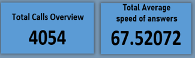

# Call Centre Trends Analysis

## Introduction
This capstone project represents a pivotal component of my training at GIT AFRICA's bootcamp. The objective was to immerse ourselves in a real-world dataset obtained online, challenging our skills in acquiring data from the internet. The project demanded expertise in data cleaning, transformation, visualization, and analysis, culminating in the creation of a robust and impactful dashboard. This hands-on experience served as a comprehensive test of our abilities in handling end-to-end data processes.

## Problem statement
Creating a dashboard in powerBI to reflects all relevant Key Performance Indicators (KPIs) and metrics in the dataset:
1.	What is the overall satisfactory rating for agents?
2.	What is the performance of agents by calls count?
3.	What is the average speed of answer by agents?
4.	What is the distribution of calls by time?
5.	Which topics are mostly been resolved?

## Data Sourcing
The program director of the bootcamp directed us to forage a website for data. Following this guidance, I downloaded the CSV file from the website and proceeded to extract it into Power BI for cleaning, analysis, and visualization.
It contains a single sheet/table:
CALL CENTRE TREND with 5,000 rows and 10 columns

## Data Transformation/Cleaning
Efficient data cleaning and transformation were executed using the Power Query Editor within Power BI. Key steps in this process included:
-	Setting the first row as the header in the CALL CENTRE TRANDS table.
-	Eliminating null values from the dataset.
-	Correcting erroneous data types to ensure accuracy and consistency.

## Data modelling
The dataset contains a single table for this analysis, so modelling was not required.

## Visualization
The report comprises of 5 tiles

1. Overall satisfactory rating for agents
2. Agents performance by calls count
3. Average speed of answer
4. Top 3 calls distribution by time
5. Topic resolution
    
You can interact with the report [here]()

## Analysis
#### Report cards

Features: 
- The first card tells us the calls overview, where the number of calls answered is 4054 and the numbers of calls abandoned is 946, resulting to a total calls record of 5000
-  The second cards shows the total average of speed of answers, which is 67.52072

#### Overall satisfactory rating for agents:  

-  Jim Rated Most Times: 1819 
-  Relationship Between Rating and Call Volume: [Performance:[Becky-517, Dan-523, Diane-501, Greg-502, Joe-484, Martha-514, Stewart-477]Rating:  [Becky-1743, Dan-1803, Diane-1706, Greg-1709, Joe-1612, Martha-1784, Stewart-1622]

Now it is clear that Jim Answered more calls and had the highest rating count.

#### Agents performance by calls count

In this metrics I was able to know the agents that is more active based on the count of Calls Answered/Abandoned.
Number of Calls Answered by Agents:
- Jim: 536 calls
- Other Agents: [Becky-517, Dan-523, Diane-501, Greg-502, Joe-484, Martha-514, Stewart-477]
- Jim count of calls makes him the outstanding agent in terms of being active.

#### Average speed of answer

This tile shows us the average speed of calls answered by each agents, this will make us understand or know the agents who spend less time attending to customers.
- Becky's Average Speed: 65.3 seconds
- Total Average Speed: 67.5 seconds
- Comparison to Other Agents: [Dan-67.3, Diane-66.3, Greg-68.4, Jim-66.3, Joe-70.9, Martha-69.4,  Stewart-66.2]

#### Top 3 calls distribution by time

This tile shows the sum of call by Time
- Metric Showing Calls Answered by Agents at Specific Times: [Jim-536, Dan-523, Becky-517]
- Jim answered more calls within 24hrs.

#### Topic resolution

This tells us the count of Resolved/Unresolved Topics
- Most Resolved Topic: Streaming (749)
- Highest Count of Non-Resolved Topics: Streaming (98)
- Topic Resolution Statistics(Resolved): [Admin Support-723,  Contract related-709, Payment related-729, Technical support-736]
- Topic Resolution Statistics(Unresolved): [Admin Support-72,  Contract related-80, Payment related-89, Technical support-69]

## Recommendation
Jim should be rewarded for being active in other to make other agents active and they should be ready to learn from him 😄, Becky should be rewarded for being fast in terms of speed, because this will really help the organization to minimize cost of calls. Topics that were not resolved should be looked into to know the agents that wouldn’t resolve issues.
 

